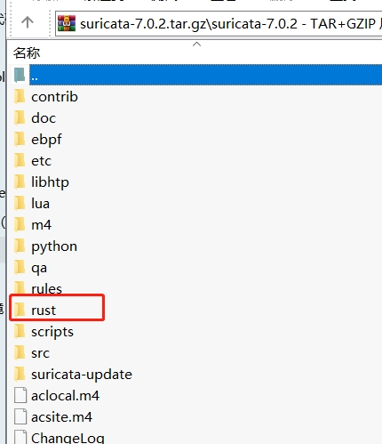
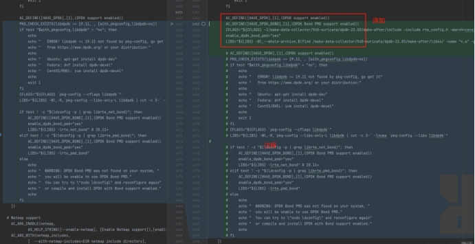

# 一、**准备工作**

## 1）**redhat****系统Yum源配置**

redhat yum命令使用报错解决-重新配置yum源

解决--更改yum源

### **(1)** 进入源目录

cd /etc/yum.repos.d/

### (2) *备份* *redhat 默认源*

mv redhat.repo redhat.repo-bak

### (3) *下载centos8源*

curl -O http://mirrors.aliyun.com/repo/Centos-8.repo

### (4) *对yum源生成缓存*

yum makecache

## 2）**Dpdk、suricata源代码下载**

### (1) *Dpdk下载链接*

http://fast.dpdk.org/rel/dpdk-23.03.tar.xz

### (2) *Suricata7.0.2源码下载链接*

https://www.openinfosecfoundation.org/download/suricata-7.0.2.tar.gz

# 二、**依赖包安装**

## 1）**yum命令安装libtool、gcc、pcre2、wget等包**

yum install -y libtool

yum install -y gcc

yum install -y gcc-c++

yum -y install gcc automake autoconf libtool make

yum install -y pcre2-devel

yum install -y wget

yum install -y  jansson-devel

yum install -y epel-release

yum -y install rustc cargo

yum -y install gd

yum install -y zlib zlib-devel

yum install -y openssl openssl-devel

yum -y  install numactl-devel

yum -y install lz4 lz4-devel

yum install -y cjson cjson-devel

## 2）**安装yaml**

***# 下载***

wget http://pyyaml.org/download/libyaml/yaml-0.2.5.tar.gz --no-check-certificate

***# 解压***

tar -zxvf yaml-0.2.5.tar.gz

***# 进入目录***

cd yaml-0.2.5

***# 执行脚本***

./configure

***# 编译安装***

make && make install

## 3）安装libpcap-devel

**\# 安装依赖**

yum -y install libpcap

***# 下载rpm包 上传到服务器***

https://vault.centos.org/centos/8/PowerTools/x86_64/os/Packages/libpcap-devel-1.9.1-5.el8.x86_64.rpm

***# 进入rpm包所在目录执行命令***

rpm -ivh libpcap-devel-1.9.1-5.el8.x86_64.rpm

## 4）安装lua-devel

***# 安装依赖***

yum -y install lua

yum -y install pkgconfig

***# 下载rpm包 上传到服务器***

https://vault.centos.org/centos/8/PowerTools/x86_64/os/Packages/lua-devel-5.3.4-12.el8.x86_64.rpm

***# 进入rpm包所在目录执行命令***

rpm -ivh lua-devel-5.3.4-12.el8.x86_64.rpm

## 5）安装librdkafka-devel

***#Rpm包下载：***
http://www.rpmfind.net/linux/centos/8-stream/PowerTools/x86_64/os/Packages/librdkafka-devel-0.11.4-1.el8.x86_64.rpm

***#安装依赖：***

yum  -y install  librdkafka

***# 进入rpm包所在目录执行命令***

rpm -ivh librdkafka-devel-0.11.4-1.el8.x86_64.rpm

## 6）libpfring-dev 安装（可以不安装）

网址：https://packages.ntop.org/centos-stable/

curl https://packages.ntop.org/centos-stable/ntop.repo > /etc/yum.repos.d/ntop.repo

yum install -y epel-release

yum clean all

yum update

yum install -y pfring-dkms n2disk nprobe ntopng cento ntap

yum install -y pfring-drivers-zc-dkms

## 7）rust最新版本安装

***将拉取依赖包并安装的脚本输出到本地rust.sh***
curl --proto '=https' --tlsv1.2 -sSf https://sh.rustup.rs > rust.sh

***更新rust.sh脚本内容***
替换 RUSTUP_UPDATE_ROOT 为：

RUSTUP_UPDATE_ROOT="https://mirrors.ustc.edu.cn/rust-static/rustup"

***然后修改环境变量：***

export RUSTUP_DIST_SERVER=https://mirrors.tuna.tsinghua.edu.cn/rustup

***执行rust.sh脚本***

chmod +x rust.sh

./rust.sh

***安装完成后重新打开终端***

rustc -V

cargo -V
## 8）Hyperscan（高性能正则表达式匹配库）

### **①**　**hyperscan需要依赖包boost-devel**

方式1：yum安装

yum install -y boost boost-devel

方式2：rpm安装

http://mirror.centos.org/centos/8-stream/AppStream/x86_64/os/Packages/boost-1.66.0-10.el8.x86_64.rpm

http://mirror.centos.org/centos/8-stream/AppStream/x86_64/os/Packages/boost-devel-1.66.0-10.el8.x86_64.rpm

### **②**　**hyperscan需要依赖包ragel**

yum install -y ragel

### **③**　**hyperscan需要依赖包pcre-devel**

***A.依赖包：pcre安装，版本需要>=8.41***

参考：https://blog.csdn.net/sa726663676/article/details/126744263

***下载：***

https://zenlayer.dl.sourceforge.net/project/pcre/pcre/8.44/pcre-8.44.tar.gz

***需要的依赖***
yum install -y bzip2-devel

yum install -y readline-devel

***执行configure***

./configure --prefix=/usr  --docdir=/usr/share/doc/pcre-8.44 --enable-unicode-properties --enable-pcre16 --enable-pcre32 --enable-pcregrep-libz --enable-pcregrep-libbz2 --enable-pcretest-libreadline --disable-static

***执行make编译***

make -j2

make check

make install

***B.安装pcre-devel***

yum install -y pcre-devel sqlite-devel

yum安装不成功的话，使用rpm安装

http://mirror.centos.org/centos/8-stream/BaseOS/x86_64/os/Packages/pcre-devel-8.42-5.el8.x86_64.rpm

### **④**　**安装hyperscan需要依赖包doxygen**

yum install -y doxygen

### **⑤**　**安装hyperscan需要依赖包Sphinx**

***A.下载适合你服务器版本的Sphinx包***

地址：http://sphinxsearch.com/downloads/release/

***B.运行安装命令***

\#依赖安装

yum install postgresql-libs unixODBC

rpm安装

rpm -Uhv sphinx-2.2.1-1.rhel6.x86_64.rpm

***D.启动Sphinx***

service searchd start

### **⑥**　**下载hyperscan，编译安装**

***下载***

https://github.com/intel/hyperscan

cd hyperscan

***编译安装***

cmake -DBUILD_STATIC_AND_SHARED=1 -DBUILD_SHARED_LIBS=off

cmake --build ./

cmake --install ./

***将编译后的文件添加到动态库加载路径中***

注意：可能需要将 /usr/local/lib 或 /usr/local/lib64 添加到ld搜索路径。通常，这是通过在 /etc/ld.so.conf.d/ 下添加一个文件来完成的，其中包含 libhs.so.5 目录位置的内容（例如超扫描5.x）。

cp /usr/local/include/hs/* /usr/include/

echo "/usr/local/lib64" > /etc/ld.so.conf.d/libhs.conf

Ldconfig

### **⑦**　**copy包到另一台服务器**

ln -s /usr/local/lib64/libhs.so.5.4.2 /usr/local/lib64/libhs.so.5

ln -s /usr/local/lib64/libhs.so.5 /usr/local/lib64/libhs.so

ln -s /usr/local/lib64/libhs_runtime.so.5.4.2 /usr/local/lib64/libhs_runtime.so.5

ln -s /usr/local/lib64/libhs_runtime.so.5 /usr/local/lib64/libhs_runtime.so
# 三、**Meson工具安装**

## 1）**安装python3的环境**

yum install -y python3

python3 -m ensurepip --upgrade

## 2）**安装meson**

pip3 install --user meson --default-timeout=10000

export PATH=$PATH:$HOME/.local/bin

使得环境变量一直有效，可编辑

/etc/profile

添加到文件最后 export PATH=$PATH:$HOME/.local/bin

source /etc/profile

查看版本

meson --version

## 3）**安装 pyelftools**

pip3 install pyelftools

## 4）**安装编译工具ninja**

yum install -y ninja-build

***x86 环境直接下载解压使用***

wget https://github.com/ninja-build/ninja/releases/download/v1.9.0/ninja-linux.zip

unzip ninja-linux.zip -d /usr/local/bin/

chmod -R 755 /usr/local/bin/ninja

# 四、**dpdk编译安装**

## 1）**解压dpdk源码包，进入目录**

tar -xf dpdk-23.03.tar.xz

cd dpdk-23.03/

## 2）**构建dpdk**

### **（1）build**

meson -Dexamples=All build

### **（2）执行configure**

***x86 环境***

meson configure -Dexamples=All build -Dprefix=/home/dpdk_lib -Dplatform=generic

**备注：-Dprefix= 后替换为自己的目录，编译后的路径**

***arm 环境***

meson configure -Dexamples=All build -Dprefix=/home/dpdk_lib -Dplatform=generic -Ddisable_drivers='common/cnxk'

**备注：-Dprefix= 后替换为自己的目录，编译后的路径**

-Dplatform=generic将使用适用于与构建机器具有相同架构的所有机器的配置。

## 3）**dpdk编译安装**

ninja install -C build

## 4）**添加到环境变量**

export PKG_CONFIG_PATH=$PKG_CONFIG_PATH:/make-data-collector/dpdk-stable-22.11.3/x86_64-native-linuxapp-gcc/lib64/pkgconfig

使得环境变量一直有效，可编辑

/etc/profile

添加到文件最后

source /etc/profile

## 5）**检测 -查看dpdk版本**

pkg-config --modversion libdpdk

# 五、**Suricata****编译安装**

## 1）**上传suricata包，解压**

tar -zxvf suricata-dev-540.tar.gz

使用源码Suricata7.0.2中rust目录的文件将自己的代码中的rust全部覆盖掉

## 2）**修改configure.ac**

### ①　**X86环境**

添加内容如下，

将/make-data-collector/540-suricata/dpdk-23.03/make-after/ 替换为dpdk编译后的实际目录

AC_DEFINE([HAVE_DPDK],[1],(DPDK support enabled))

AC_DEFINE([HAVE_DPDK_BOND],[1],(DPDK Bond PMD support enabled))

CFLAGS="${CFLAGS} -I/make-data-collector/540-suricata/dpdk-23.03/make-after/include -include rte_config.h -march=corei7 "

enable_dpdk_bond_pmd="yes"

LIBS="${LIBS} -Wl,--whole-archive,$(find /make-data-collector/540-suricata/dpdk-23.03/make-after/lib64/ -name "*.a" -printf "%p," | sed 's/,$//'),--no-whole-archive -Wl,-Bdynamic -ldl  -L/root/openssl-1.0.2u -lcrypto -lssl -lnuma -lm "

### ②　**Arm环境**

添加内容如下，

将/make-data-collector/540-suricata/dpdk-23.03/make-after/ 替换为dpdk编译后的实际目录

AC_DEFINE([HAVE_DPDK],[1],(DPDK support enabled))

AC_DEFINE([HAVE_DPDK_BOND],[1],(DPDK Bond PMD support enabled))

CFLAGS="${CFLAGS} -I/make-data-collector/540-suricata/dpdk-23.03/make-after/include -include rte_config.h -march=armv8-a+crc "

enable_dpdk_bond_pmd="yes"

LIBS="${LIBS} -Wl,--whole-archive,$(find /make-data-collector/540-suricata/dpdk-23.03/make-after/lib64/ -name "*.a" -printf "%p," | sed 's/,$//'),--no-whole-archive -Wl,-Bdynamic -ldl  -L/root/openssl-1.0.2u -lcrypto -lssl -lnuma -lm "

## 3）**执行./configure**

### ③　**更新配置文件**

autoreconf -ivf

### ④　**执行脚本**

./configure --enable-rust=yes --enable-gccmarch-native=no --enable-dpdk=yes --enable-libmagic=yes CPPFLAGS=-I/usr/include/ CFLAGS=-g --prefix=/usr --sysconfdir=/etc --localstatedir=/var --enable-nfqueue --enable-lua --enable-dpdk --enable-rdkafka

--prefix= 后边的路径是suricata编译后的二进制文件所在目录，可以自行修改

## 4）**执行make**

make -j && make install 

 